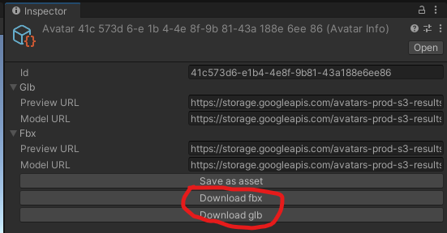

# in3D Avatars Unity SDK (minimal)


## Description
SDK contains in3D Api interface. This SDK gives access to in3D avatar models, textured, fully rigged, prepared for animations.
- We use async, so Unity under 2017 is not supported.
- We do not use third party plugins for json deserialization or web requests. So platform support depends on Unity version.

## Features
- Login in3d user
- Get list of users avatars
- Get urls for avatars models
- Downloading of avatars glb and fbx models in editor 
- No dependencies

## Installation
Please follow the instructions:
### Install via Unity Package Manager

1. Open **Edit->Project Settings->Package Manager**
2. Add a new Scoped Registry for SDK
    ```
    Name: unity.in3d.io
    URL: https://unity.in3d.io
    Scope(s): com.in3d.sdk
    ```
3. Click **Save** (or **Apply**)
4. Install packages in PackageManager / My Registries

**Alternatively**, merge the snippet to **Packages/manifest.json**
```json
{
  "scopedRegistries": [
    {
      "name": "unity.in3d.io",
      "url": "https://unity.in3d.io",
      "scopes": [
        "com.in3d.sdk"
      ]
    }
  ],
  "dependencies": {
    "com.in3d.sdk.minimal": "last"
  }
}
```

## How to use
Create user credentials scriptable object via unity **Project window -> Create -> in3D -> Access Key Credentials**.
In created object set up **Access Key** field with key from in3d mobile application and set server settings (use settings shipped with this package).
Another way to create user credentials is via script:
```c#
ScriptableObject.CreateInstance<AccessKeyCredentials>().Init("access key", ServerSettings.Default);
```

Use `AccessKeyCredentials.Login()` function to get `IUser` object. 
Via this object you can access avatars.
Fetch avatars for user from server:
```c#
await user.UpdateAvatarsListAsync();
```

Now you can access avatars previews and models via web-api:
```c#
foreach (var avatar in user.Avatars) {
    var fbxPreviewUri = avatar[ModelFormat.Fbx].PreviewUrl;
    var fbxModelUri = avatar[ModelFormat.Fbx].ModelUrl;
    var glbPreviewUri = avatar[ModelFormat.Glb].PreviewUrl;
    var glbModelUri = avatar[ModelFormat.Glb].ModelUrl;
    
    // Place your code for models and previews downloading here
}
```
Full example:
```c#
public async Task LoadAllAvatarsAsync(string userAccessKey)
{
    var creds = AccessKeyCredentials.Create(userAccessKey, ServerSettings.Default);

    IUser user;
    try {
        user = await creds.LoginAsync();
    }
    catch (InvalidCredentialsException) {
        Debug.LogError("Cannot login user due to invalid credentials");
        return;
    }

    await user.UpdateAvatarsListAsync();

    foreach (var avatar in user.Avatars) {
        var fbxPreviewUri = avatar[ModelFormat.Fbx].PreviewUrl;
        var fbxModelUri = avatar[ModelFormat.Fbx].ModelUrl;
        var glbPreviewUri = avatar[ModelFormat.Glb].PreviewUrl;
        var glbModelUri = avatar[ModelFormat.Glb].ModelUrl;
    
        // Place your code for models and previews downloading here
    }
}
```

Be aware that uris for models and previews fetched using `user.UpdateAvatarsListAsync()` will be 
valid only for next few hours. So if you are getting error when trying to access model or preview 
try to update avatars list again. Avatars Ids are permanent, you can update links using `user.UpdateAvatarAsync(avatar)`.

If you want to download fbx of glb models in editor use:
```c#
AvatarInfo avatar = /**/;
await avatar.SaveFbxToEditorAsync();
// or
await avatar.SaveGlbToEditorAsync();
```
or you can access AvatarInfo scriptable object in editor and press the button for downloading.


## Support
- E-mail: hello@in3d.io
- Discord: https://discord.gg/bRzFujsHH9

## Project status
Ongoing
